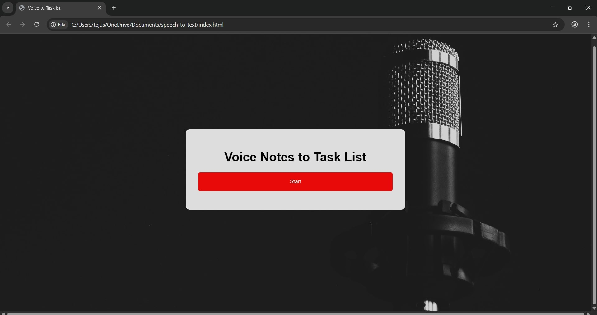

# Voice-to-tasklist

A voice-controlled to-do list built using the Web Speech API.

## Features
- Add tasks with your voice
- Click tasks to mark them as completed
- Simple and clean UI

## Setup
1. Clone the repo
```bash
git clone https://github.com/Tejaswiseelam/voice-to-tasklist.git
cd voice-to-tasklist
```

2. Open `index.html` in a browser (Chrome recommended).

## Demo
Check the [`Demo.mp4`](Demo.mp4) for a demonstration.

## Deployment
App is deployed at: https://tejaswiseelam.github.io/voice-to-tasklist/

## Screenshot


